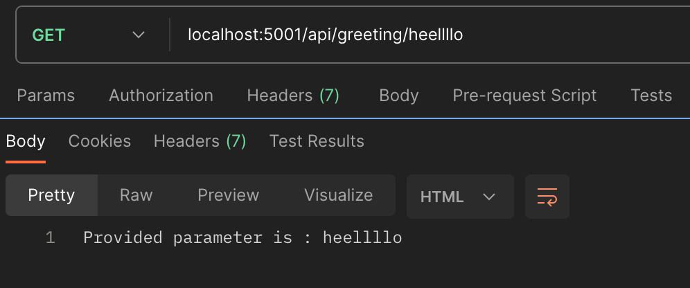
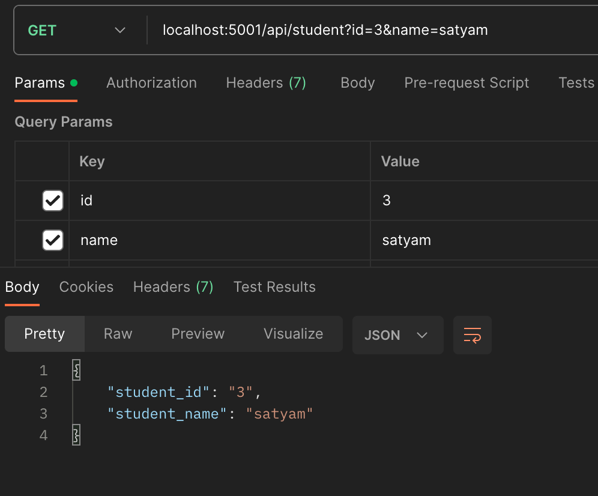
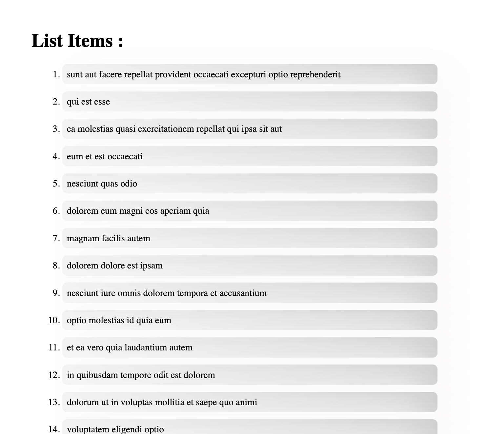

# Internshala TA assignment solution

### Problem statement 1 : 
#### Write a MongoDB query to find all documents in a collection where a particular field has a value greater than a certain value.

### Solution : 
- Create database of student 
```
use students;
```
- Create collection named student_details to store detail about student
```
db.createCollection("student_detail")
```


- Insert data in student_detail collection
```
db.student_detail.insertOne({name: "Harsh", age: 21, batch: "2020 - 2024"})
```
```
db.student_detail.insertMany([{name: "Sumit", age: 24, batch: "2018 - 2022"}, {name: "Aryan", age: 220, batch: "2020 - 2024”}, {name: "Ronak", age: 24, batch: "2018 - 2022”}, {name: "Sahil", age: 22, batch: "2020 - 2024”}, {name: "Satyam", age: 22, batch: "2019 - 2023"}])
```


- Now we have required amount of data to 
- apply query to find documents in collection where age is greater than a certain number like in our case we are writing for age greater than 23

```
db.student_detail.find({age: {$gt: 23} })
```
- OUTPUT -> 

```
[
  {
    _id: ObjectId("652d58eea0c59a080b9e98a9"),
    name: 'Ronak',
    age: 24,
    batch: '2018 - 2022'
  },
  {
    _id: ObjectId("652d5a00a0c59a080b9e98aa"),
    name: 'Sumit',
    age: 24,
    batch: '2018 - 2022'
  },
  {
    _id: ObjectId("652d5a00a0c59a080b9e98ab"),
    name: 'Aryan',
    age: 220,
    batch: '2020 - 2024'
  }
]
```

### Problem statement 2 : 
#### Write a simple express.js route that takes in a parameter from the url and return it as a response.

### Solution :
#### You can move to folder solution_2 and follow below steps to see the solution.

- move to solution_2 folder using command :
```
cd solution_2
```
- install all dependencies by running this command :
```
npm i 
```
- run server with following command :
```
npm run dev
```
- open browser at http://localhost:5001/api/greeting/:value if parameter is directly passsed in url. example image is below :



- open browser at http://localhost:5001/api/student?id=somevalue&name=somevalue if you want to use query way. through this method you will get information like below image : 




### Problem statement 3 : 
#### Write a react component that renders a list of items fetched from an API.

### Solution :
#### You can move to folder solution_3_listRender and follow below steps to see the solution.
#### I have used https://jsonplaceholder.typicode.com/posts Api and axios to fetch data.

- move to solution_3_listRender folder using command :
```
cd solution_3_listRender
```
- install all dependencies by running this command :
```
npm i 
```
- run server with following command :
```
npm run dev
```
- follow the link which you will get in terminal to see the output.
- You can see Output Image below as well : 

